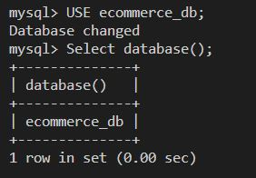

# Sadlers E-Commerce Back End

## Description

Sadlers e-commerce back end can be used by businesses in the internal retail sector for building their E-commerce platform. The back end of this project uses Express.js API and Sequelize to interact with a MySQL database.

## Access

The URL of the GitHub repository ...

https://github.com/lynnadelesadler/Sadlers-E-Commerce-Back-End

The URL of the video walk through  ...

https://drive.google.com/file/d/1Dbt4mSWf6atF4-ne04YXE5s617zvuw78/view

## Installation
- Install node.js if not already installed on your machine
- Open the project in Integrated Terminal. 
- Run the command `npm i` to install all node files.
- Confirm you are connected to MySQL by running the command `mysql -u root -p` 
- In the terminal run the command `source db/schema.sql`
- In the terminal run the command `USE ecommerce_db`
- In the terminal run the command `Select database();` to confirm you are connected to the ecommerce database.
- Navigate back to node in the terminal and run the command  `npm run seed`
- once complete run the command `npm run start` to connect to the database.

## Usage & Visuals

- WHEN I add my database name, MySQL username, and MySQL password to an environment variable file

- THEN I am able to connect to a database using Sequelize.

- WHEN I enter schema and seed commands, THEN a development database is created and is seeded with test data.

- WHEN I enter the command to invoke the application, THEN my server is started and the Sequelize models are synced to the MySQL database.

- WHEN I open API GET routes in Insomnia for categories, products, or tags, THEN the data for each of these routes is displayed in a formatted JSON. Here is an example of the GET All route for Tags.

- WHEN I test API POST, PUT, and DELETE routes in Insomnia, THEN I am able to successfully create, update, and delete data in my database.

### Database Models

The Database contains 2 tables including the requirements listed for each table:

* `Category`

  * `id`

    * Integer.
  
    * Doesn't allow null values.
  
    * Set as primary key.
  
    * Uses auto increment.

  * `category_name`
  
    * String.
  
    * Doesn't allow null values.

* `Product`

  * `id`
  
    * Integer.
  
    * Doesn't allow null values.
  
    * Set as primary key.
  
    * Uses auto increment.

  * `product_name`
  
    * String.
  
    * Doesn't allow null values.

  * `price`
  
    * Decimal.
  
    * Doesn't allow null values.
  
    * Validates that the value is a decimal.

  * `stock`
  
    * Integer.
  
    * Doesn't allow null values.
  
    * Set a default value of `10`.
  
    * Validates that the value is numeric.

  * `category_id`
  
    * Integer.
  
    * References the `Category` model's `id`.

* `Tag`

  * `id`
  
    * Integer.
  
    * Doesn't allow null values.
  
    * Set as primary key.
  
    * Uses auto increment.

  * `tag_name`
  
    * String.

* `ProductTag`

  * `id`

    * Integer.

    * Doesn't allow null values.

    * Set as primary key.

    * Uses auto increment.

  * `product_id`

    * Integer.

    * References the `Product` model's `id`.

  * `tag_id`

    * Integer.

    * References the `Tag` model's `id`.
## Support
For help with this webpage please contact
|Name | Email |
|-----------|---------------------------|
|Lynn Sadler| lynnadelesadler@yahoo.com |

## Roadmap
Check back to this page as enhancements could be made for usability and optimized display.

## Authors and acknowledgment
Acknowledgment to  Node.js, MySQL, and Sequelize as this application runs off these applications.  

Coding credit to be given to Lynn Sadler for working off the sourecode provided by the Uconn Full Stack Web Developer Bootcamp and completing the code to successfully run the application.

Acknowledgement to Uconn Full Stack Web Developer Bootcamp, Teachers and Teacher assistants for supporting me on my developer journey!

## License
N/A

